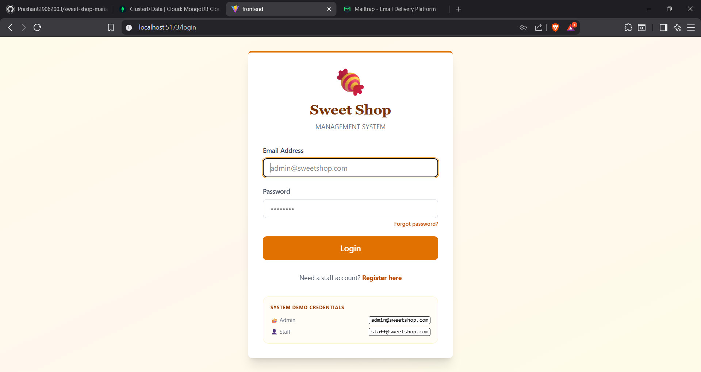
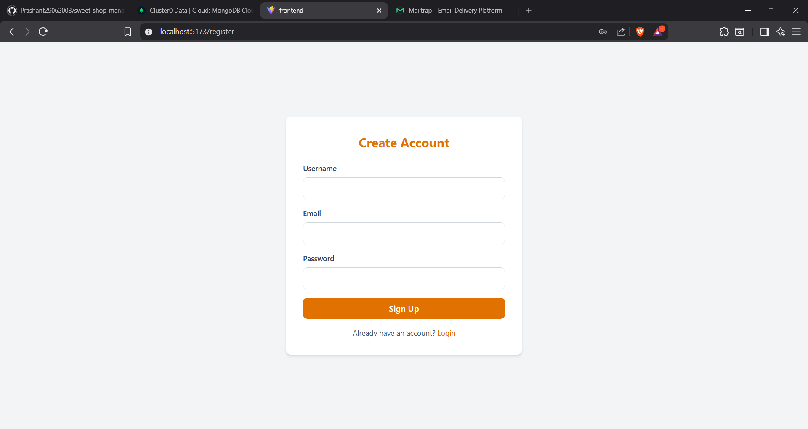
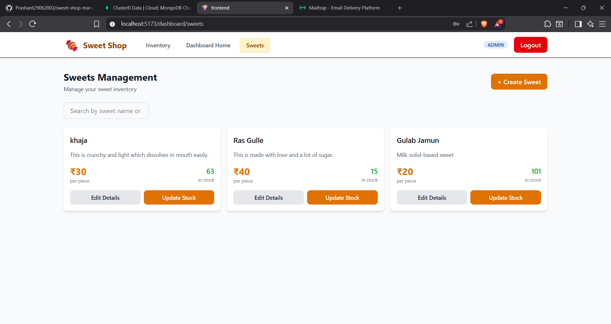
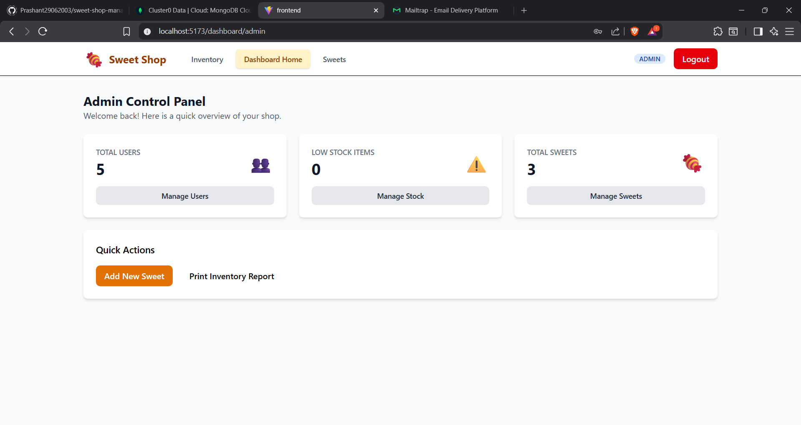
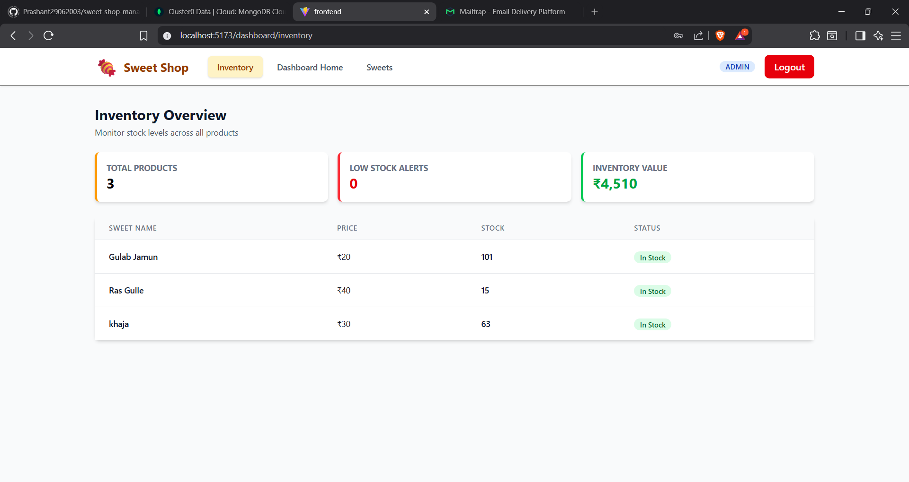

# 🍬 Sweet Shop Management System

A full-stack web application for managing a sweet shop’s inventory, users, and roles with secure authentication, role-based access control, and real-time stock monitoring.

---

## 📌 Overview

The **Sweet Shop Management System** helps shop owners and staff manage sweets inventory efficiently while enforcing secure access rules for different user roles such as **Admin**, **Staff**, and **Customer**.
It is built with a modern MERN-style stack and follows clean backend architecture practices.

---

## 🚀 Features

### 🔐 Authentication & Security

* JWT-based authentication (Access & Refresh Tokens)
* Secure login, logout, and session handling
* Email verification during user registration
* Password reset via email
* Role-based access control (RBAC)

### 👥 User & Role Management

* Roles: **Admin**, **Staff**, **Customer**
* Admin-only user creation with role assignment
* Permission-based route protection
* View all registered users (Admin)

### 🍭 Sweets & Inventory Management

* Create, update, delete sweets
* Separate inventory update endpoint
* Real-time stock tracking
* Low-stock indicators
* Inventory overview dashboard

### 📊 Admin Dashboard

* Total users count
* Total sweets count
* Low-stock sweets overview

### 🧪 Testing

* Backend unit and integration testing
* MongoDB Memory Server for isolated test runs
* Jest + Supertest

---

## 🧰 Tech Stack

| Layer          | Technology                       |
| -------------- | -------------------------------- |
| Frontend       | React, Vite, Axios, React Router |
| Backend        | Node.js, Express.js              |
| Database       | MongoDB, Mongoose                |
| Styling        | Tailwind CSS                     |
| Authentication | JWT (Access & Refresh Tokens)    |
| Email          | Nodemailer + Mailgen             |
| Testing        | Jest, Supertest                  |

---

## 📁 Project Structure

```bash
sweet-shop-management-system/
├── backend/
│   ├── src/
│   │   ├── modules/
│   │   │   ├── auth/
│   │   │   ├── admin/
│   │   │   ├── sweets/
│   │   ├── models/
│   │   ├── middlewares/
│   │   ├── utils/
│   │   └── routes/
│   ├── tests/
│   └── server.js
├── frontend/
│   ├── src/
│   │   ├── api/
│   │   ├── components/
│   │   ├── context/
│   │   ├── hooks/
│   │   └── pages/
│   └── vite.config.js
└── README.md
```

---

## 🛠️ Installation & Setup

### Prerequisites

* **Node.js** v18+
* **npm** v9+
* **MongoDB** (Local or MongoDB Atlas)

---

### 🔧 Backend Setup

```bash
cd backend
npm install
```

Create a `.env` file inside `backend/`:

```env
PORT=8000
NODE_ENV=development
MONGODB_URI=mongodb+srv://<user>:<password>@cluster.mongodb.net/your_db_name

ACCESS_TOKEN_SECRET=your_access_token_secret
REFRESH_TOKEN_SECRET=your_refresh_token_secret

MAILTRAP_SMTP_HOST=sandbox.smtp.mailtrap.io
MAILTRAP_SMTP_PORT=2525
MAILTRAP_SMTP_USER=your_mailtrap_user
MAILTRAP_SMTP_PASS=your_mailtrap_pass
```

Start the backend server:

```bash
npm run dev
```

---

### 🎨 Frontend Setup

```bash
cd frontend
npm install
```

Create a `.env` file inside `frontend/`:

```env
VITE_API_URL=http://localhost:8000/api/v1
```

Start the frontend:

```bash
npm run dev
```

---

## 🔐 API Reference (Key Endpoints)

### Authentication

| Method | Endpoint         | Description       | Access        |
| ------ | ---------------- | ----------------- | ------------- |
| POST   | `/auth/register` | Register new user | Public        |
| POST   | `/auth/login`    | Login user        | Public        |
| GET    | `/auth/me`       | Get current user  | Authenticated |
| POST   | `/auth/logout`   | Logout user       | Authenticated |

### Admin

| Method | Endpoint             | Description           | Access |
| ------ | -------------------- | --------------------- | ------ |
| POST   | `/admin/create-user` | Create user with role | Admin  |
| GET    | `/admin/users`       | Fetch all users       | Admin  |

### Sweets & Inventory

| Method | Endpoint                | Description          | Access        |
| ------ | ----------------------- | -------------------- | ------------- |
| GET    | `/sweets`               | Fetch all sweets     | Authenticated |
| POST   | `/sweets`               | Create sweet         | Admin / Staff |
| PUT    | `/sweets/:id`           | Update sweet details | Admin / Staff |
| PATCH  | `/sweets/:id/inventory` | Update inventory     | Admin / Staff |

---

## 🧪 Testing

Run backend tests:

```bash
cd backend
npm test
```

Tests include:

* Auth controller
* Permission middleware
* Sweets CRUD operations

---

## 📸 Screenshots

### 🔐 Authentication System
The application features a secure, branded entry point with distinct demo credentials and real-time validation.

| **Login Interface** | **Account Registration** |
| :---: | :---: |
|  |  |
| **Login Page**: Includes system demo credentials and secure JWT-based session handling. | **Registration**: Implements automatic role assignment and email format validation. |

---

### 🏠 Main Navigation
The landing area adapts its navigation links based on the authenticated user's role.

**Home Page** A clean entry point providing quick access to the inventory, dashboard, and product catalog.  


---

### 📊 Administrative Suite
Designed for administrators to monitor the entire shop ecosystem and manage user access levels.

**Admin Control Panel** Displays high-level metrics including total user count, real-time stock alerts, and quick action shortcuts.  


**User Management Portal** Allows administrators to create staff accounts, update user roles (Admin/Staff/Customer), or securely delete users.  


---

### 🍬 Inventory & Business Intelligence
Tools for managing physical products and tracking the financial health of the shop.

**Inventory Financial Overview** A business intelligence tool that calculates the total monetary value of all stock on hand and highlights low-stock items.  


**Sweets Management Section** A user-friendly grid view where staff can edit product details or perform instant stock updates for individual items.  


---

## 🤝 Contributing

Contributions are welcome.

Steps:

1. Fork the repository
2. Create a new branch
3. Commit changes with clear messages
4. Open a Pull Request

---

## 📄 License

Copyright (c) 2025 **Prashant Kumar**

This project is licensed under the **MIT License**.

For more details, see the [LICENSE](LICENSE) file in the root of this repository.
